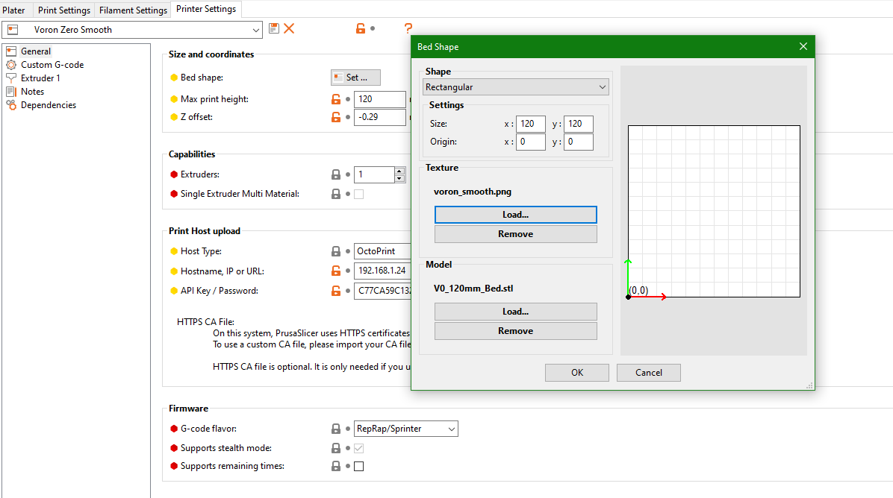

# Notes about slicer

1. You need to adjust slicer profile per material you are using
2. If you are not using 350mm bed, adjust bed size.
3. If you are using different nozzle, then adjust it's size.
4. We recommend using [SuperSlicer](https://github.com/supermerill/SuperSlicer) for Voron Printers.

## Where to set the model and textures:
 

# Sources:
[Voron Extras Github](https://github.com/VoronDesign/Voron-Extras)
[Voron 2 Github](https://github.com/VoronDesign/Voron-2)
